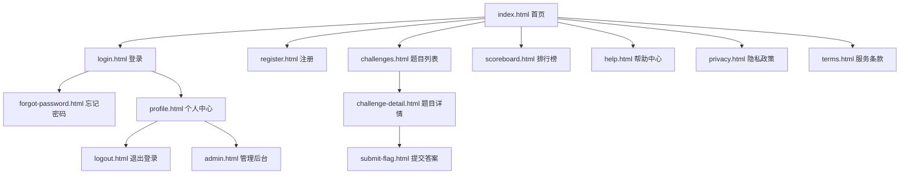

# QHU-CTF竞赛平台

## 🎯 项目简介

这是QHUCTF竞赛平台的HTML5基础结构阶段，专注于构建完整的语义化HTML页面，为后续的CSS样式和JavaScript交互功能奠定基础。

## 📁 文件结构

```
0-html/
├── 📄 README.md                 # 项目说明文档
├── 📄 project-summary.md        # 项目总结文档
├── 📄 step.md                   # 分步实现计划
│
├── 🏠 index.html                # 首页 - 平台入口和概览
├── 🔐 login.html                # 登录页面 - 用户认证
├── 📝 register.html             # 注册页面 - 用户注册
├── 🔑 forgot-password.html      # 忘记密码 - 密码重置
├── 🚪 logout.html               # 退出登录 - 安全退出确认
│
├── 🎯 challenges.html           # 题目列表 - 挑战题目展示
├── 📋 challenge-detail.html     # 题目详情 - 单个题目详细信息
├── 📤 submit-flag.html          # 提交答案 - Flag提交界面
│
├── 🏆 scoreboard.html           # 排行榜 - 实时排名展示
├── 👤 profile.html              # 个人中心 - 用户资料和成就
├── ⚙️ admin.html                # 管理后台 - 平台管理功能
│
├── ❓ help.html                 # 帮助中心 - 使用指南和FAQ
├── 🔒 privacy.html              # 隐私政策 - 数据保护说明
└── 📜 terms.html                # 服务条款 - 使用规则协议
```

## 🔗 页面导航关系



## ✨ 技术特点

### 🏷️ HTML5语义化
- 使用完整的HTML5语义标签（header, nav, main, section, article, aside, footer）
- 合理的内容结构和层次关系
- 语义化表单设计

### ♿ 无障碍访问性
- 完整的ARIA属性支持
- 键盘导航友好
- 屏幕阅读器优化
- 符合WCAG 2.1 AA级标准

### 📱 响应式基础
- 正确的viewport设置
- 为CSS Grid/Flexbox预留结构
- 移动优先的HTML结构

### 🔍 SEO优化
- 完整的meta标签信息
- 语言标识和国际化支持
- 结构化数据友好

## 🚀 快速开始

### 本地预览
```bash
# 进入项目目录
cd S:\SunskyFiles\Projects\Security\ctfsite\learn\0-html

# 启动本地服务器
python -m http.server 8080

# 在浏览器中访问
http://localhost:8080
```

### 页面访问
- **首页**: http://localhost:8080/index.html
- **登录**: http://localhost:8080/login.html
- **注册**: http://localhost:8080/register.html
- **题目**: http://localhost:8080/challenges.html
- **排行榜**: http://localhost:8080/scoreboard.html
- **个人中心**: http://localhost:8080/profile.html

## 📊 完成状态

| 功能模块 | 页面数量 | 完成状态 |
|---------|---------|---------|
| 用户认证 | 4页面 | ✅ 100% |
| 题目系统 | 3页面 | ✅ 100% |
| 用户中心 | 2页面 | ✅ 100% |
| 平台管理 | 1页面 | ✅ 100% |
| 信息页面 | 4页面 | ✅ 100% |

**总计**: 14个HTML页面，100%完成

## 🔧 开发规范

### 代码风格
- 使用2空格缩进
- 语义化标签优先
- 统一的class命名规范
- 完整的注释说明

### 文件命名
- 使用小写字母和连字符
- 语义化的文件名
- 统一的扩展名（.html）

### 结构规范
- 统一的页面头部结构
- 一致的导航栏设计
- 标准化的表单布局
- 规范的页脚信息

## 📋 下一步计划

### 1-CSS阶段
- [ ] 设计系统建立
- [ ] 响应式布局实现
- [ ] 主题系统开发
- [ ] 动画效果添加

### 2-JavaScript阶段
- [ ] 交互功能实现
- [ ] 表单验证逻辑
- [ ] 数据动态加载
- [ ] 用户体验优化

## 📞 联系信息

**开发者**: sunsky
**更新时间**: 2025/9/19
**项目地址**: https://github.com/TianJiHub/QHU-CTF

## 📚 相关文档

- [项目总结文档](./project-summary.md) - 详细的技术总结和实现说明
- [分步实现计划](../step.md) - 完整的开发规划和里程碑

---

**当前状态**: 0-HTML阶段 ✅ 已完成  
**下一阶段**: 1-CSS样式开发